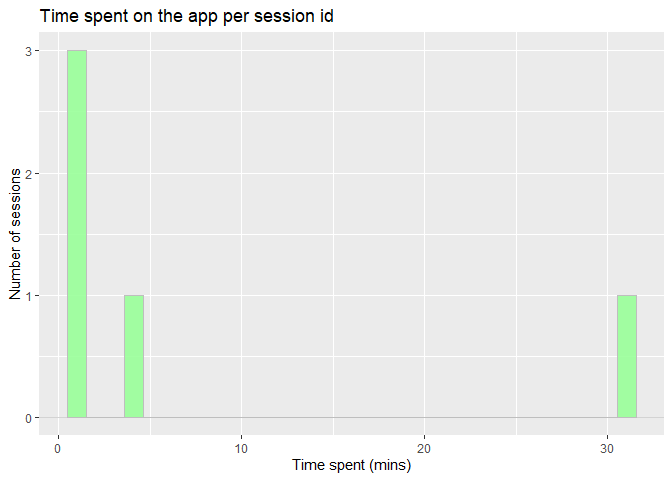

<!-- README.md is generated from README.Rmd. Please edit that file -->

# mtrailz4r

<!-- badges: start -->

[](https://github.com/TeroJii/mtrailz4r/actions/workflows/R-CMD-check.yaml)
[](https://app.codecov.io/gh/TeroJii/mtrailz4r?branch=main)
[](https://lifecycle.r-lib.org/articles/stages.html#experimental)
<!-- badges: end -->

The goal of mtrailz4r is to help with specific data processing steps…

## TO-DO

- [ ] Consider adding a function for extracting user_properties
- [ ] Add functions for visualization
  - [x] Function for plotting most popular routes
  - [x] Function for plotting time spent

## Installation

You can install the development version of mtrailz4r from
[GitHub](https://github.com/) with:

``` r
# install.packages("remotes")
remotes::install_github(repo = "TeroJii/mtrailz4r")
```

Use the release tags to install a specific version. For example to
install version 0.0.4:

``` r
# install.packages("remotes")
remotes::install_github(repo = "TeroJii/mtrailz4r@v0.0.4")
```

## Example

This is a basic example which shows you how to solve a common problem:

``` r
library(mtrailz4r)
## basic example code
mockdata |> 
  mt4r_unnest() |> 
  mt4r_fixtime() |> 
  mt4r_addsessionid() |> 
  plot_exertime()
```


